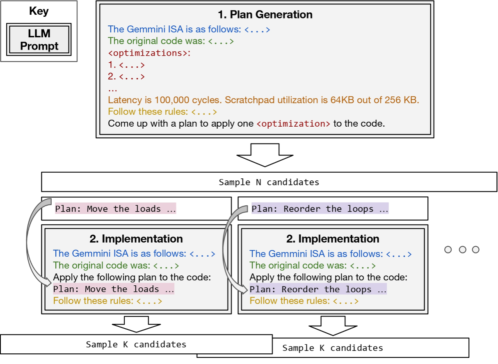

<figure>
    
    <figcaption>The growing landscape of tensor accelerators.</figcaption>
</figure>

# Autocomp: LLM-Driven Code Optimization for Tensor Accelerators

[Charles Hong](https://charleshong3.github.io/), [Sahil Bhatia](https://x.com/sahilb17), [Alvin Cheung](https://people.eecs.berkeley.edu/~akcheung/), and [Yakun Sophia Shao](https://people.eecs.berkeley.edu/~ysshao/)

---

### New LLM-driven methods for code optimization help hardware designers extract the full performance of AI accelerators

### See the [paper](https://arxiv.org/abs/2505.18574) for full technical details.

---

By this point, we’re all aware of the remarkable capabilities of large language models (LLMs). Whether it’s summarizing, rewriting, or generating new ideas, LLMs far exceed the abilities of previous techniques when it comes to dealing with any textual interface, including code. Yet, anyone who has tried to code with LLMs knows their limitations. While ChatGPT can whip up practically any boilerplate Python script you could ask for, it becomes much less reliable when more niche APIs or languages come into play, let alone new hardware platforms.

As computer architecture researchers at UC Berkeley’s SLICE Lab, we became interested in leveraging LLMs to write low-level software for hardware accelerators (see below for why this is an important problem). However, we found that LLMs couldn’t accomplish much in a zero-shot setting (see our [prior work](https://arxiv.org/abs/2408.03408)), and given the nature of pre-training, we don’t think this will change any time soon. We believe this calls for a more domain-specific approach.

Specifically, we present **Autocomp**, the first LLM-driven code optimization approach for low-resource tensor accelerator code generation. Autocomp incorporates domain knowledge, hardware correctness/performance feedback, and novel strategies for response diversity to automatically search for performant code. 

Our generated code **significantly outperforms hand-optimized code** across a wide range of workloads and across different tensor accelerator configurations. We also find that schedules generated by Autocomp provide valuable insight into the scheduling process, and can be reused to speed up scheduling of new, similar workloads.

Read the rest of this blog post for a full explanation of our methods and learn about the incredibly promising results\!

# Background 

## Tensor accelerators

Hardware accelerators have become a critical driving force for the recent breakthroughs in machine learning. They provide hundred-fold improvements in performance and energy efficiency in running deep neural networks (DNNs), and this has led to an increasing number of accelerators for tensor processing in recent years. These accelerators take advantage of DNNs’ regular tensor-based computations, the limited number of operators used, and their low-precision data representations by using specialized hardware architectures such as systolic arrays. Despite these simplifications, there are many different ways to build a tensor accelerator. They differ in size, dataflow, programming model, etc., ranging from the tiny Raspberry Pi AI HAT to Cerebras’s wafer-scale CS-3 and beyond.

## How is accelerator code written today? 

Most users write hardware-agnostic code in libraries such as PyTorch or JAX. However, this code need to be translated to the underlying hardware. You likely know that when PyTorch code is run on NVIDIA GPUs, that code eventually gets compiled to CUDA. But what about other accelerators? Some compilers, like XLA, TVM, and Triton, support a few different hardware backends, but primarily focus on CPUs and GPUs. Generally, software for a new accelerator must be developed by whoever built it, and this is no easy task.

Adapting compilers to new hardware platforms has always been difficult, due to things like vendor- and implementation-specific ISAs (instruction set architectures). As a result, new accelerator implementations often require large amounts of hand-optimized code written for key kernels such as matrix multiplication or convolution. And even once a compiler exists, generating performant code runs into the classical “scheduling” problem, i.e., deciding which optimizations to apply and in what order. For general-purpose backends (CPUs and GPUs), these passes have been iteratively developed and refined by experts over many years, and there is plenty of data available to train deep learning models or even LLMs. However, this is not the case for new hardware.

<figure>
    
    <figcaption>Tensor accelerator developers hard at work\! (as imagined by GPT-4o)</figcaption>
</figure>

## Tensor accelerator programming

So, what do these difficult-to-write programs actually look like? To begin with, programming tensor accelerators differs greatly from programming general-purpose CPUs. Tensor accelerators focus on the efficient execution of fixed-size (e.g., 16x16) matrix multiplication instructions. Rather than trying to reduce the number or type of these instructions, software optimization focuses on other aspects, such as:

* Minimizing explicitly-managed data movement between main memory and smaller accelerator-local memories (below, the scratchpad and accumulator).  
* Setting global configuration state at runtime for varying types of tensor computation and data movement.  
* Scheduling or reordering operations to maximally overlap computation and data movement.

Code transformations that enable these optimizations range from low-level changes like arithmetic simplification or instruction selection, to higher-level changes like loop tiling, hoisting , or software pipelining. These changes can be complex, making them challenging to implement in a low-resource DSL. Below is an example of software pipelining in a pseudocode tensor accelerator DSL. While bearing resemblance to the classical CPU version of software pipelining, explicitly managed data movement in tensor accelerators means that in addition to reordering instructions, scratchpad addresses must also be carefully managed to achieve functional correctness, let alone high performance.

<figure>
    
    <figcaption>Architecture and dataflow of a tensor accelerator system.</figcaption>
</figure>

```c
// Unoptimized
for (int k = 0; k < 8; k++) {
    for (int i = 0; i < 32; i++) {
        dma_mvin(A[i*16][k*64], spad_addr);
        for (int k_i = 0; k_i < 4; k_i++) {
            compute(spad_addr + k_i * 16, ...);

// Optimized
for (int k = 0; k < 8; k++) {
    spad_addr = base_spad_addr;
    dma_mvin(A[0][k*64], spad_addr);
    for (int i = 0; i < 32; i++) {
        dma_mvin(A[(i+1)*16][k*64], spad_addr + 64);
        for (int k_i = 0; k_i < 4; k_i++) {
            compute(spad_addr + k_i * 16, ...);
        spad_addr += 64;
```
Example of software pipelining in tensor accelerators. The A matrix tile is spread throughout accelerator memory rather than repeatedly loaded to the same location, allowing data loading to run ahead and overlap with computation.

# The Autocomp Approach

Leveraging the recent advances in LLMs for code, we present Autocomp, which uses an iterative LLM-guided search framework to optimize accelerator code. Unlike previous compilers, Autocomp can adapt to new hardware platforms and ISAs by simply changing prompts. Unlike existing tensor DSLs, Autocomp automatically generates optimized code without manual tuning. And unlike data-driven approaches targeting CPUs and GPUs, Autocomp requires no model training, instead leveraging LLM in-context reasoning and pretrained knowledge of common optimizations. 

**How?** Prior work across general-purpose LLM prompt design and LLM code generation shows that decomposing tasks into multiple steps can improve an LLM’s ability to solve them. For code optimization, we split our workflow into two phases: optimization plan generation and code implementation. We repeat this **Plan-then-Implement** process on generated code, completing the optimization loop with an iterative beam search (animated below). Beam search allows us to keep the best code candidates at each step, as well as explore multiple optimization trajectories in parallel.

<figure>
    
</figure>

## Phase 1: Plan

We prompt an LLM to select *one* optimization from a predefined menu of optimization options and to describe the concrete transformations required to apply it. Since we’re working with a low-resource DSL, we make sure to include all necessary information in context. The planning prompt includes the following components: **Accelerator ISA**, **Current Code, Hardware Performance Feedback, Optimization Menu, Instruction,** and **Rules** (See the paper for full details)**.** We then sample $N$ different plans, since there are many possible ways to schedule a tensor accelerator workload\!

## Phase 2: Implement

Following phase 1, we have a plan that outlines the specific transformation for the selected optimization. To generate optimized code, in phase 2 we prompt the LLM to apply the transformations in the plan to generate new, semantically equivalent code. The implementation prompt (phase 2\) contains many of the same elements as the planning prompt (phase 1). We sample $K$ independent code candidates for each plan to improve the likelihood of implementing the plan correctly.  

<figure>
    
</figure>

## Survival of the Fastest (and Correct): Beam Search

To efficiently explore several optimizations in parallel, we use a traditional beam search, with beam width of $B$. The animated figure above shows how beam search would work for a beam size $B=2$. Our beam search integrates the two phases described above, but only candidates which meet the following criteria can enter the beam:

* **✅Correctness.** After each code generation step, every candidate is compiled and run against our functional test suite.  
* **⚡Performance.** Next, we measure the latency of functionally correct candidates via cycle-accurate simulation. Only candidates that are faster than their “parent” i.e., the version they were derived from are retained.

Of the functionally correct candidates, we keep the best (lowest latency) $B$ to seed the next iteration of beam search. We run this loop for a fixed budget of iterations.

## Increasing Plan and Code Diversity

We use the following two techniques to boost the diversity in plan (and in the case of LLM ensembling, code) generation and prevent the model from repeatedly selecting the same optimization:

* **Optimization Menu Dropout.** Inspired by methods for preventing neural networks from overfitting, we implement dropout in our optimization menu. Each time a plan candidate is generated, each menu option in the list of optimizations has a chance to be dropped (we use 70% in the paper).  
* **LLM Ensembling.** Ensembling LLMs is known to improve diversity and quality of results. To further increase the diversity of generated plans and code, in each case where multiple candidates are sampled, we divide these requests between different LLMs. In the experiments below, we ensemble o3-mini and gpt-4o.

# Applying Autocomp to Gemmini (Not Gemini\!)

To be clear, Gemmini isn’t a chatbot or an AI model. It’s an open-source hardware generator developed by researchers at UC Berkeley for building custom tensor accelerators. Gemmini is ideal for evaluating Autocomp because:

* **Performance.** It generates accelerators with performance comparable to commercial hardware.  
* **Customizable.** It’s open-source, so we can tweak hardware design, modify the software stack and generate detailed performance data.  
* **Simulation Support.** It integrates with fast and cycle-accurate hardware simulators (specifically FireSim).   
* **No Data Contamination.** Its low-resource nature makes it challenging to directly prompt LLMs.

In this blog, we optimize matrix multiplication (GEMM) code to illustrate Autocomp’s performance. Check out our paper for the complete set of results, which covers a broader set of workloads including convolution and fine-grained linear algebra kernels.

| Baseline | Description |
| :---- | :---- |
| Gemmini Software Library | Uses heuristics to tile and run GEMMs/convs on generated accelerators. |
| Exo (unoptimized) | DSL for tensor code \+ basic compiler for Gemmini accelerators. The starting point for Autocomp-based optimization. |
| Exo (optimized) | Extensively hand-tuned Exo schedules written by experts for each GEMM and conv benchmark. |
| Hardware FSM | Custom FSM units inside Gemmini for GEMM/conv ops. Highly tuned, fully parallel hardware reaching up to 99% compute utilization. We use this as an upper bound for GEMM/conv benchmarks. |

## GEMM Scheduling Results

To evaluate how well Autocomp performs, we optimize a variety of different shapes and sizes matrix multiplication from the Resnet-50 model.   

<figure>
    
</figure>

**Performance Comparison:**

🚀Autocomp consistently outperforms all baselines:

* **1.4x** faster than Exo’s hand-optimized code  
* **2.9x** faster than unoptimized Exo baseline (our starting point)  
* **5.6x** faster than Gemmini’s default software library.  
* Autocomp consistently reaches at least **85%** of the hardware FSM’s utilization.

**Why does it work so well?**

Autocomp shines because of its ability to effectively explore the optimization space, especially around double-buffering, software pipeline and loop tiling. This results in better overlap of data movement and computation resulting in significant performance boost. Appendix C of our paper breaks down how Autocomp optimizes one of the GEMM kernels over the course of multiple iterations.

# Improving Sample Efficiency With Schedule Reuse 

We know that running a large number of LLM invocations and hardware simulations can be costly, and it seems like a waste not to do anything with the super-high-performance schedules we’re discovering. So, we checked if we could reuse Autocomp-generated schedules for certain GEMM workloads to help optimize new, similarly sized GEMM kernels. This isn’t a new technique; traditional optimized libraries like BLAS reuse hand-tuned schedules across similar GEMM shapes.

First, we recorded the best known schedule for a particular GEMM. Then, during planning for new GEMMs with the same aspect ratios or with two shared dimensions, rather than exploring the full menu, we prompted the LLMs to select specifically the menu options used in our recorded schedule, one at a time. We could then use a smaller beam width and sample count. After completing this lightweight search, we took the best-performing code so far and further refine it by invoking the full Autocomp search for a small number of iterations. We initially focus on exploitation by applying a few known-good optimizations, then begin exploration after paring down the search space.

<figure>
    
</figure>

Over several different GEMM sizes, we found that this process improved performance by 24% under a 100-sample budget. And above, you can see the full optimization trace for schedules transferred between two square matrices (1024×1024×1024 to 512×512×512) and between two column-dominant matrices (12544x256x64 to 12544x128x64). Across sample counts, the headstart provided by schedule reuse leads to consistently better results.

# Key takeaways

LLMs can’t optimize low-resource code out of the box, but there are a few steps you can take that just might make your problem tractable.

* **Don’t try to zero-shot your problem.** We decompose code optimization into a search problem, then break each iteration down into 2 phases (planning and implementation). Then we explore every step of the way\!
* **LLMs aren’t always smarter than you.** We find that much of the prior work relies on an LLM to analyze bottlenecks or suggest optimizations. But when we asked LLMs to analyze our code, the responses were usually incorrect, and while some LLM suggestions were helpful, they weren’t very diverse. Encoding domain knowledge via an optimization menu alleviates these issues.  
* **Introduce noise.** While sampling is extremely helpful, techniques that boost diversity (menu dropout and LLM ensembling) can push diversity of responses even further, allowing for more exploration.

Contact Charles ([charleshong@berkeley.edu](mailto:charleshong@berkeley.edu)) or Sahil ([sahilbhatia@berkeley.edu](mailto:sahilbhatia@berkeley.edu)) if you have any questions\!
