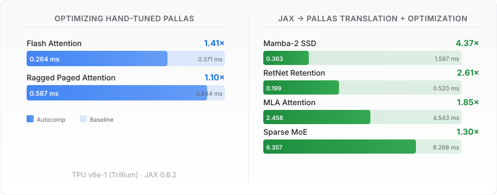
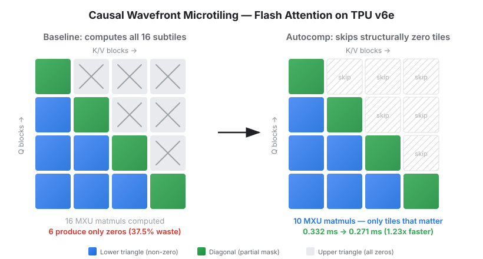

# We pointed our automatic agent builder at TPU docs. It came back with 4x faster kernels.

#### April 10, 2026

[Charles Hong](https://charleshong3.github.io/){:target="_blank" rel="noopener"} (UC Berkeley & Google)

*This work was done at UC Berkeley.*

### [Autocomp](https://github.com/ucb-bar/autocomp){:target="_blank" rel="noopener"} now supports [Google TPU](https://cloud.google.com/tpu/docs/intro-to-tpu){:target="_blank" rel="noopener"}! We built the optimization agent **automatically** from public documentation, and used it to speed up production [Pallas](https://docs.jax.dev/en/latest/pallas/index.html){:target="_blank" rel="noopener"} kernels, including FlashAttention, by up to **1.41x** and vanilla JAX workloads by up to **4.37x**.

<h3 style="margin-top: 0; margin-bottom: 15px; color: #333;">📋 Table of Contents</h3>

<ul style="margin: 0; padding-left: 20px; line-height: 1.4;">
<li><a href="#building-the-tpu-agent">Building the TPU Agent</a></li>
<li><a href="#benchmarks">Benchmarks</a></li>
<li><a href="#flash-attention">Flash Attention: Eliminating 37.5% of wasted compute</a></li>
<li><a href="#ragged-paged-attention">Ragged Paged Attention: The long tail of optimization</a></li>
<li><a href="#results">Results</a></li>
<li><a href="#conclusion">Conclusion</a></li>
</ul>

<!-- <figure>
    
    <figcaption style="text-align:center">TODO: TPU hero image.</figcaption>
</figure> -->

<figure>
    
</figure>

## Building the TPU Agent

A quick recap: [Autocomp](https://github.com/ucb-bar/autocomp){:target="_blank" rel="noopener"} is our LLM-driven code optimization framework for tensor accelerators. It integrates domain knowledge, hardware correctness/performance feedback, and novel strategies for response diversity to automatically search for performant code.

Adding a new hardware target to Autocomp requires two things: a hardware-aware optimization agent and an evaluation backend. For previous targets (Gemmini, AWS Trainium, NVIDIA GPUs, RISC-V Vector), building the agent involved significant manual effort: copy-and-pasting documentation, writing optimization strategies by hand, and encoding hardware-specific constraints.

For TPU, we used Autocomp's [Agent Builder](https://github.com/ucb-bar/autocomp/tree/main/autocomp/agent_builder){:target="_blank" rel="noopener"} to generate the [entire agent](https://github.com/ucb-bar/autocomp/tree/main/autocomp/agent_builder/.built/tpu-v6e){:target="_blank" rel="noopener"} automatically. We pointed it at four documentation sources:

1. [Pallas overview](https://docs.jax.dev/en/latest/pallas/index.html){:target="_blank" rel="noopener"} — `pallas_call`, grid/BlockSpec API
2. [TPU Pallas guides](https://docs.jax.dev/en/latest/pallas/tpu/index.html){:target="_blank" rel="noopener"} — matmul, pipelining, DMA
3. [TPU Pallas API reference](https://docs.jax.dev/en/latest/jax.experimental.pallas.tpu.html){:target="_blank" rel="noopener"} — full API surface
4. [TPU hardware docs](https://docs.cloud.google.com/tpu/docs/){:target="_blank" rel="noopener"} — architecture, memory hierarchy

From these, the Agent Builder synthesized **22 TPU-specific optimization strategies** (on top of 15 default strategies), a 3300-line ISA reference, an architecture summary, and correctness rules. This is the first Autocomp agent built from scratch with the Agent Builder; we never wrote a hand-built agent for TPU. Strategies like "mark grid dimensions as parallel" and "fuse RHS transpose into `dot_general`" turned out to be directly useful in the optimizations we describe below.

<figure>
    
    <figcaption style="text-align:center">The Agent Builder ingests documentation sources and produces a complete hardware-specific agent configuration.</figcaption>
</figure>

## Benchmarks

We evaluate on two categories of workloads, all running on a **TPU v6e-1** (Trillium) with **JAX 0.6.2**:

**Category 1 — Optimizing hand-tuned Pallas kernels.** Production kernels from upstream JAX, already hand-optimized by Google engineers. Specifically we optimized the [Flash Attention](https://github.com/jax-ml/jax/blob/main/jax/experimental/pallas/ops/tpu/flash_attention.py){:target="_blank" rel="noopener"} and [Ragged Paged Attention](https://github.com/jax-ml/jax/tree/main/jax/experimental/pallas/ops/tpu/ragged_paged_attention){:target="_blank" rel="noopener"} kernels. Model shapes are drawn from Llama-3.1-8B. These are hard baselines since the starting code is already well-optimized.

**Category 2 — Translating and optimizing vanilla JAX.** Four workloads from [JAXBench](https://github.com/aryatschand/JAXBench){:target="_blank" rel="noopener"} starting as unoptimized JAX code, which Autocomp first translates into Pallas and then optimizes. These include MLA Attention, RetNet Retention, Sparse MoE, and Mamba-2 SSD. Here the baseline is the original JAX implementation running through XLA, and there is significantly more headroom for optimization.

## Flash Attention: Eliminating 37.5% of wasted compute {#flash-attention}

We optimized Google's highly optimized Flash Attention implementation directly pulled from JAX's codebase. Autocomp found a 3-step optimization chain that speeds it up by **1.41x** (0.371 ms → 0.264 ms):

**Step 1: Unnormalized online softmax** (0.371 → 0.332 ms). The baseline normalizes running softmax statistics on every K/V block iteration, dividing by the running sum of exponentials and rescaling the accumulator. Autocomp defers all normalization to a single pass after the loop, eliminating per-iteration reciprocal computations and matrix-vector multiplies.

**Step 2: Causal wavefront microtiling** (0.332 → 0.271 ms). For causal attention with Q and KV sequence lengths of 2048, the Q×K matmul computes a 4×4 grid of subtiles. The causal mask zeroes out the 6 upper-triangular subtiles entirely. The baseline computes all 16 subtiles and masks afterward. Autocomp rewrites the inner loop to skip the 6 structurally zero subtiles, computing only the 10 that contribute to the output. This is an algorithmic insight, not a micro-optimization, and eliminates 37.5% of the MXU work.

**Step 3: Head-axis coarsening** (0.271 → 0.264 ms). The v6e-1 has a single TensorCore, so per-head kernel launch overhead is nontrivial. Autocomp batches 2 heads per program, reducing launch count by half.

Different LLMs contributed different steps: Gemini 3 Flash planned the softmax rewrite, GPT-5.4 planned the wavefront tiling and head coarsening, and Claude Opus 4.5 wrote all three implementations. We've uploaded the [full optimization trace](https://github.com/ucb-bar/autocomp/blob/main/examples/jaxbench-pallas/flash_attention_trace.py){:target="_blank" rel="noopener"} and [final generated kernel](https://github.com/ucb-bar/autocomp/blob/main/examples/jaxbench-pallas/flash_attention_final.py){:target="_blank" rel="noopener"} for you to explore.

<figure>
    
    <figcaption style="text-align:center">Causal wavefront microtiling eliminates 37.5% of wasted MXU compute by skipping structurally zero subtiles in the Q×K matmul.</figcaption>
</figure>

## Ragged Paged Attention: The long tail of optimization {#ragged-paged-attention}

Ragged Paged Attention (RPA) is vLLM's decode-phase attention kernel for batched inference with a paged KV cache. Unlike Flash Attention, RPA is memory-bound, so there is no single algorithmic win to be had. Instead, Autocomp found **11 incremental optimizations** over 15 search iterations, each shaving off fractions of a millisecond:

Hoisting loop-invariant computations, pre-folding query scaling into the Q tensor, removing redundant VMEM-to-VMEM transfers, restructuring data layouts for contiguous access, enabling parallel grid dimensions. Each change is small on its own, but they compound to a **1.10x speedup** (0.644 ms → 0.587 ms).

This kind of improvement matters at serving scale: RPA runs on every decode step for every request, so even a 10% latency reduction translates directly to higher throughput and lower tail latency. See the [full optimization trace](https://github.com/ucb-bar/autocomp/blob/main/examples/jaxbench-pallas/ragged_paged_attention_trace.py){:target="_blank" rel="noopener"} and [final generated kernel](https://github.com/ucb-bar/autocomp/blob/main/examples/jaxbench-pallas/ragged_paged_attention_final.py){:target="_blank" rel="noopener"}.

## Results

### Category 1 — Optimizing hand-tuned Pallas

| **Kernel** | **Baseline** | **Autocomp** | **Speedup** |
|---|---|---|---|
| [flash_attention](https://github.com/ucb-bar/autocomp/blob/main/examples/jaxbench-pallas/flash_attention_final.py){:target="_blank" rel="noopener"} | 0.371 ms | 0.264 ms | **1.41x** |
| [ragged_paged_attention](https://github.com/ucb-bar/autocomp/blob/main/examples/jaxbench-pallas/ragged_paged_attention_final.py){:target="_blank" rel="noopener"} | 0.644 ms | 0.587 ms | **1.10x** |

<!-- TODO: add results for splash_attention, paged_attention, matmul, megablox_gmm, fused_moe once runs complete -->

### Category 2 — Translating and optimizing vanilla JAX

| **Kernel** | **JAX Baseline** | **Autocomp** | **Speedup** |
|---|---|---|---|
| [mamba2_ssd](https://github.com/ucb-bar/autocomp/blob/main/examples/jaxbench-priority/mamba2_ssd_final.py){:target="_blank" rel="noopener"} | 1.587 ms | 0.363 ms | **4.37x** |
| [retnet_retention](https://github.com/ucb-bar/autocomp/blob/main/examples/jaxbench-priority/retnet_retention_final.py){:target="_blank" rel="noopener"} | 0.520 ms | 0.199 ms | **2.61x** |
| [mla_attention](https://github.com/ucb-bar/autocomp/blob/main/examples/jaxbench-priority/mla_attention_final.py){:target="_blank" rel="noopener"} | 4.543 ms | 2.458 ms | **1.85x** |
| [sparse_moe](https://github.com/ucb-bar/autocomp/blob/main/examples/jaxbench-priority/sparse_moe_final.py){:target="_blank" rel="noopener"} | 8.268 ms | 6.357 ms | **1.30x** |

For Category 2 workloads, Autocomp first translates vanilla JAX code into Pallas kernels and then iteratively optimizes them. The largest win is on Mamba-2 SSD (**4.37x**), where the translation to Pallas with explicit memory management provides a large baseline improvement, and subsequent optimizations further close the gap to hardware limits.

<!-- TODO: speedup bar charts -->

## Conclusion

TPU is Autocomp's 5th hardware target (after Gemmini, AWS Trainium, NVIDIA GPUs, and RISC-V Vector processors) and the first where the optimization agent was built fully autonomously by the Agent Builder from public documentation. The results show that this auto-generated agent is effective. It can speed up already-optimized production kernels and produce large gains on workloads translated from vanilla JAX.

Check out the [Autocomp repo](https://github.com/ucb-bar/autocomp){:target="_blank" rel="noopener"}, our [paper](https://arxiv.org/abs/2505.18574){:target="_blank" rel="noopener"}, the [TPU agent configuration](https://github.com/ucb-bar/autocomp/tree/main/autocomp/agent_builder/.built/tpu-v6e){:target="_blank" rel="noopener"}, and the [generated kernels and traces](https://github.com/ucb-bar/autocomp/tree/main/examples){:target="_blank" rel="noopener"}. Feel free to reach out at [charleshong@berkeley.edu](mailto:charleshong@berkeley.edu) if you have any questions or want help getting started.
