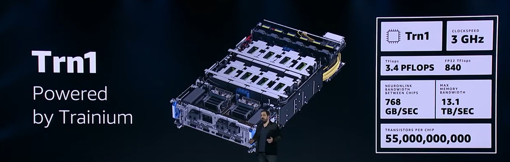
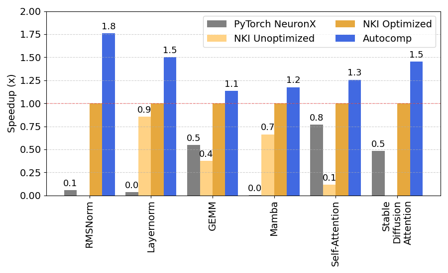
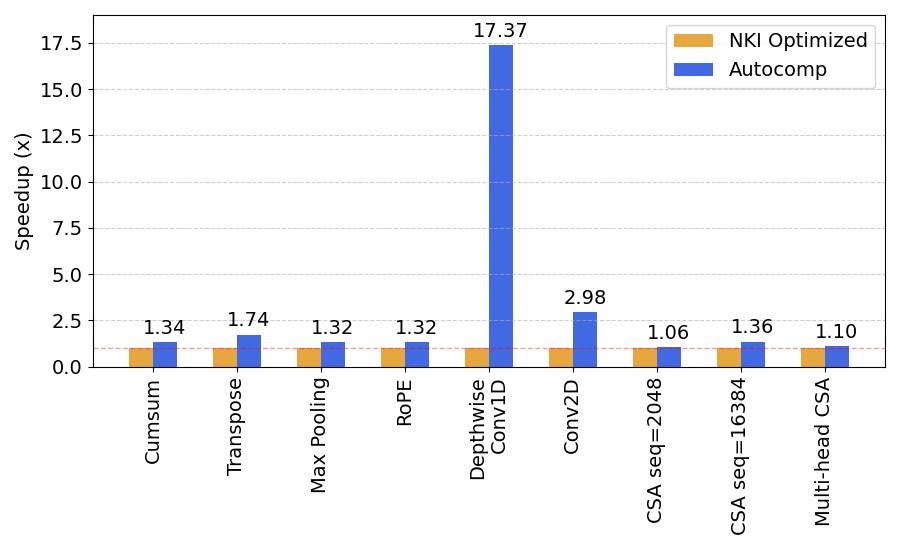

# Speeding up NKI (AWS Trainium) kernels with Autocomp

#### November 3, 2025

[Charles Hong](https://charleshong3.github.io/){:target="_blank" rel="noopener"}, [Sahil Bhatia](https://x.com/sahilb17){:target="_blank" rel="noopener"}, [Alvin Cheung](https://people.eecs.berkeley.edu/~akcheung/){:target="_blank" rel="noopener"}, and [Yakun Sophia Shao](https://people.eecs.berkeley.edu/~ysshao/){:target="_blank" rel="noopener"}
 
UC Berkeley

### [Autocomp](https://github.com/ucb-bar/autocomp){:target="_blank" rel="noopener"} now supports [Trainium](https://aws.amazon.com/ai/machine-learning/trainium/){:target="_blank" rel="noopener"}! We are able to speed up several vendor-optimized kernels from [`nki-samples`](https://github.com/aws-neuron/nki-samples){:target="_blank" rel="noopener"}, achieving up to 17x the performance of hand-optimized code.

<h3 style="margin-top: 0; margin-bottom: 15px; color: #333;">📋 Table of Contents</h3>

<ul style="margin: 0; padding-left: 20px; line-height: 1.4;">
<li><a href="#about-trainium">About Trainium</a></li>
<li><a href="#results">Results</a>
  <ul style="margin: 0; padding-left: 20px; line-height: 1.4;">
    <li><a href="#tutorial-workloads">Tutorial Workloads</a></li>
    <li><a href="#advanced-workloads">Advanced Workloads</a></li>
  </ul>
</li>
<li><a href="#conclusion">Conclusion</a></li>
</ul>

<figure>
    
    <figcaption style="text-align:center">From Trainium 1 announcement (<a href="https://www.nextplatform.com/2021/12/02/aws-sizes-trainium-for-ai-ml-model-boom/">The Next Platform</a>).</figcaption>
</figure>

## About Trainium

Trainium is a family of state-of-the-art tensor accelerators built and deployed by Amazon Web Services (AWS). We optimize code for Trainium 1 (specifically, a `trn1.2xlarge` instance). 
This instance contains two NeuronCore-v2, each of which contains scalar, vector, and tensor (systolic array) engines, as well as on-chip scratchpad and accumulator memories (called SBUF and PSUM), which communicate with main memory, and supports a wide range of data types. You can read more about Trainium's architecture in the AWS [documentation](https://awsdocs-neuron.readthedocs-hosted.com/en/latest/about-neuron/arch/neuron-hardware/trainium.html#trainium-arch){:target="_blank" rel="noopener"}.

Trainium's software stack includes several different entry points for users, including high-level frontends like PyTorch and JAX. If you use PyTorch, Trainium's [NeuronX compiler](https://awsdocs-neuron.readthedocs-hosted.com/en/latest/frameworks/torch/torch-neuronx/api-reference-guide/inference/api-torch-neuronx-trace.html#torch-neuronx-trace-api){:target="_blank" rel="noopener"}, based on the XLA compiler, can automatically optimize a PyTorch module by tracing it and taking advantage of fixed shapes and fixed control flows to produce a fused computation graph. However, this prevents the user from implementing low-level optimizations.

In this blog post, we optimize code written in the [Neuron Kernel Interface (NKI)](https://awsdocs-neuron.readthedocs-hosted.com/en/latest/nki/index.html){:target="_blank" rel="noopener"}, which enables lower-level control of computation and data movement.
And while Trainium accelerators are a real-world, high-performance industry backend, they are very low-resource, as Trainium was first deployed in [2022](https://aws.amazon.com/blogs/aws/amazon-ec2-trn1-instances-for-high-performance-model-training-are-now-available/){:target="_blank" rel="noopener"} with NKI only being released in [2024](https://aws.amazon.com/about-aws/whats-new/2024/09/aws-neuron-nki-nxd-training-jax/){:target="_blank" rel="noopener"}. This makes Trainium a challenging target for LLM-based code generation and an ideal target for Autocomp. 

For evaluation, Trainium provides the [`nki-samples`](https://github.com/aws-neuron/nki-samples){:target="_blank" rel="noopener"} repository, which contains naive, unoptimized NKI implementations of several tensor kernels in the directory [`src/nki_samples/tutorial`](https://github.com/aws-neuron/nki-samples/tree/5cfeabca92a64f642a154ef835cbcede609016a3/src/nki_samples/tutorials){:target="_blank" rel="noopener"}. For several of these kernels,
`nki-samples` also provides optimized versions of these naive implementations in the same directory. 

In addition, `nki-samples` provides a set of advanced implementations that "showcase cutting-edge optimizations and specialized implementations" of key kernels in the directory [`contributed/neuron-team-kernels`](https://github.com/aws-neuron/nki-samples/tree/5cfeabca92a64f642a154ef835cbcede609016a3/contributed/neuron-team-kernels){:target="_blank" rel="noopener"}. These are optimized implementations written by kernel engineers at AWS.

Now, let's dive into the results!

## Results

As discussed above, we optimize two categories of Trainium benchmarks: *Tutorial* (starting from naive code and comparing to optimized code) and *Advanced* (starting from optimized code). For each benchmark, we manually specify relevant instructions, and include a description and examples (sourced from Trainium's documentation) for only those instructions in the **Accelerator ISA** section of the prompt (see our updated [paper](https://arxiv.org/abs/2505.18574){:target="_blank" rel="noopener"} for details). Furthermore, as Trainium's compiler provides decent error messages for syntax errors, when a code implementation fails correctness checking, we prompt the LLM with the Accelerator ISA, the code, and the compiler-generated error message, and then evaluate the fixed code again.

For all experiments, we ensemble OpenAI's o4-mini and gpt-5 for both phases. We search with 75% menu dropout, beam size B=6, N=6 plans per candidate in the beam, K=2 code implementations per plan, and T=10 iterations.

The tables below detail the shapes and configurations used for our Trainium evaluation.
Reference code was directly copied from the `nki-samples` repository, with some implementations requiring small modifications to run on a `trn1.2xlarge` instance.
We attempted to use the same shapes as in the original `nki-samples` code, whenever examples were provided and the shapes were large enough to show meaningful performance improvements. 

### Tutorial Workloads

| **Operator** | **Configuration** |
|--------------|-------------------|
| RMSNorm | 4096 × 512 |
| LayerNorm | 4096 × 8192 |
| GEMM | 4096 × 8192 × 8192 |
| Mamba | batch=1, seq_len=2048, channel=256, state_size=16 |
| Self-Attention | d_head=128, seq_len=4096 |
| Stable Diffusion Attention | d_head=64, seq_len=4096 |

As mentioned above, AWS provides a set of tutorial NKI implementations that demonstrate varying levels of optimization. These workloads include key deep learning operators of varying scopes, detailed in the table above. For these workloads, we start optimization from the unoptimized naive NKI implementation, if one is available (for RMSNorm and Stable Diffusion attention, we start from the optimized implementation).

Many of the optimizations in our **Optimization Menu** for Trainium are based on these tutorials, so we expect Autocomp to at least match the performance of the fully optimized code. Autocomp not only does so, but as shown in the figure below, **outperforms hand-optimized code by a geomean of 1.36x**. In doing so, Autocomp speeds up the starting code used as input (either unoptimized or optimized NKI code) by a geomean of 2.51x.

The `nki-samples` repository also contains PyTorch implementations of these operators, which we compile with Trainium's NeuronX compiler. Autocomp-generated code outperforms the code compiled from PyTorch by 13.52x.

<figure>
    
    <figcaption style="text-align:center">Performance of Autocomp-generated code on tutorial workloads.</figcaption>
</figure>

### Advanced Workloads

| **Operator** | **Configuration** |
|--------------|-------------------|
| Cumsum | 4096 × 4096 |
| Transpose | 512 × 512 × 512, (012) → (021) |
| Max Pooling | 448 × 448, pool 3 × 3 |
| RoPE | 128 × 4096 |
| Depthwise Conv1D | input NCHW = (8, 512, 1, 2048), kernel CHW = (512, 1, 3) |
| Conv2D | batch=16, input=128×128, kernel=3×3, in_channel=128, out_channel=512 |
| Causal Self-Attention seq=2048 | d_head=128, seq_len=2048 |
| Causal Self-Attention seq=16384 | d_head=128, seq_Q=128, seq_KV=16384 |
| Multi-head Causal Self-Attention | n_head=8, d_head=128, seq_len=2048 |

AWS also provides a set of highly optimized NKI implementations written by expert kernel engineers. For these workloads, we start search from the already optimized code. Since these workloads are already optimized, any improvement is a highly positive result. As shown in the figure below, we find that Autocomp is able to optimize these workloads by a geomean of 1.9x. Unfortunately, no matching PyTorch implementation is provided for these workloads.

Notably, Autocomp speeds up 1D depthwise convolution by **17.37x**! It does so through a sequence of optimizations that takes advantage of both the specific target shape as well as the code's inherent inefficiencies: first, it decreases allocated tile sizes in the scratchpad to prevent spilling to main memory, which allows the next iteration to move the new smaller tile-sized accumulations into the accumulator. Then, it swaps loop ordering to increase filter reuse over batches, and finally, re-expands scratchpad tile size by adding a new level of tiling over the long output dimension, increasing data reuse in the scratchpad.

Other highlights include speeding up 2D convolution by **2.98x** and causal self-attention by up to **1.36x**. 

<figure>
    
    <figcaption style="text-align:center">Performance of Autocomp-generated code on advanced workloads.</figcaption>
</figure>

## Conclusion

We are excited but unsurprised to see that Autocomp works well for NKI kernels on Trainium, given its success across a variety of hardware platforms (see blogs [1](https://charleshong3.github.io/blog/autocomp.html){:target="_blank" rel="noopener"} and [2](https://charleshong3.github.io/blog/autocomp_update.html){:target="_blank" rel="noopener"}).

Feel free to reach out at [charleshong@berkeley.edu](mailto:charleshong@berkeley.edu) if you have any questions or want help getting started with Autocomp. More blog posts to come!

Thanks to [Huijae An](https://www.linkedin.com/in/huijae-an/){:target="_blank" rel="noopener"} for help with understanding Trainium and NKI.