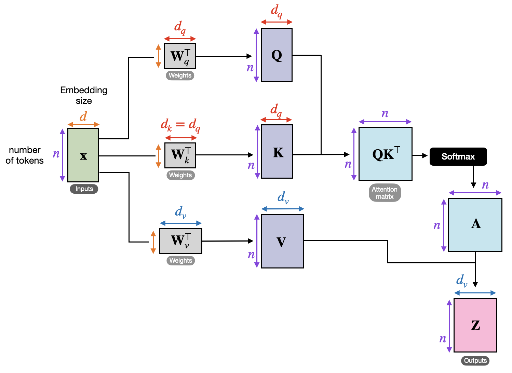

# How we made attention 45% faster on AWS Trainium

#### January 8, 2026

[Huijae An](https://www.linkedin.com/in/huijae-an/){:target="_blank" rel="noopener"} and [Charles Hong](https://charleshong3.github.io/){:target="_blank" rel="noopener"}
<br/>
UC Berkeley

### This post explores how we used Autocomp to optimize the [AWS Neuron Team](https://github.com/aws-neuron)’s [self-attention tutorial](https://awsdocs-neuron.readthedocs-hosted.com/en/v2.26.1/nki/tutorials/fused-self-attn.html) kernel, achieving a **1.45× speedup** in the final implementation!

<div style="background-color: #f8f9fa; border: 2px solid #e9ecef; border-radius: 8px; padding: 20px; margin: 20px 0; box-shadow: 0 2px 4px rgba(0,0,0,0.1);">

<h3 style="margin-top: 0; margin-bottom: 15px; color: #333;">📋 Table of Contents</h3>

<ul style="margin: 0; padding-left: 20px; line-height: 1.4;">
<li><a href="#about-autocomp">About Autocomp</a></li>
<li><a href="#about-self-attention">About Self-Attention</a></li>
<li><a href="#the-original-kernel">The Original Kernel</a></li>
<li><a href="#optimization-steps">Optimization Steps</a></li>
<li><a href="#conclusion">Conclusion</a></li>
</ul>

</div>

## About [Autocomp](https://github.com/ucb-bar/autocomp){:target="_blank" rel="noopener"}

As a quick refresher, Autocomp is our AI-driven tool for optimizing code for tensor accelerators. It uses a combination of domain knowledge, hardware correctness/performance feedback, and novel strategies for response diversity to automatically search for performant code. So far, it supports AWS Trainium (an industry accelerator), Gemmini (Berkeley's academic accelerator), NVIDIA GPUs, and even partially supports an RVV-compliant dev board.

You can read more about Autocomp in our previous blog posts, starting with [the first Autocomp blog post](https://charleshong3.github.io/blog/autocomp.html).
Its code is open-source and available on our [GitHub repo](https://github.com/ucb-bar/autocomp){:target="_blank" rel="noopener"}. We welcome any and all users and contributors!

## About Self-Attention

Now let's talk about the workload we're optimizing.
Self-attention, the foundation for modern [transformer](https://medium.com/@amanatulla1606/transformer-architecture-explained-2c49e2257b4c) architectures, is a special case of [attention](https://en.wikipedia.org/wiki/Attention_(machine_learning)) where each token gathers context from all other tokens in the sequence. In other words, the Q, K, and V tensors are all computed from the same input.

<figure>
    
    <figcaption style="text-align:center">From <a href="https://sebastianraschka.com/blog/2023/self-attention-from-scratch.html" target="_blank" rel="noopener">Sebastian Raschka</a>.</figcaption>
</figure>

Note that this is not the *causal* (or *masked*) version of self-attention, where certain elements are masked out. This is typically used for autoregressive generation in decoder transformers like GPT, where you want to generate the next token based only on past tokens (meaning you need to mask out future tokens during training). We have also optimized causal self-attention kernels—see the [full paper](https://arxiv.org/abs/2505.18574) for details!

## The Original Kernel

[Trainium](https://aws.amazon.com/ai/machine-learning/trainium/){:target="_blank" rel="noopener"} is Amazon's state-of-the-art tensor accelerator. It's currently one of the backends supported by Autocomp. The compiler teams at AWS have graciously provided several tutorials and reference kernels (discussed further in our [previous blog post](/blog/autocomp_trainium.html)).

We copied the reference code for our attention kernel directly from AWS’s [Fused Self-Attention tutorial](https://awsdocs-neuron.readthedocs-hosted.com/en/v2.26.1/nki/tutorials/fused-self-attn.html). It is implemented in Trainium's [Neuron Kernel Interface (NKI)](https://awsdocs-neuron.readthedocs-hosted.com/en/v2.26.1/nki/index.html), Trainium's Python-embedded DSL for writing high-performance kernels. It already implements several optimizations, so we’ll take any speedup we can get. Note that we optimize for the specific case with the parameters `use_causal_mask=False, mixed_precision=True`. Here’s a rough pseudocode of the original kernel, assuming those parameter values:

```python
def fused_self_attention(Q, K, V):
    """
    Q Shape: [seqlen, d_head]
    K Shape: [seqlen, d_head]
    V Shape: [seqlen, d_head]
    """
    # 0. Allocate the final output
    out_ref = nl.array((seqlen, d_head))
    
    # 1-a. Fetch Q, K, and V into Trainium's Scratchpad (SBUF)
    trans_v = nl.array((128, seqlen // 128, d_head))
    for i in range(seqlen // 128):
        trans_v[:, i, d_head] = nl.load(...)
    q_local = nl.array((seqlen // 128, d_head, 128))
    for i in range(seqlen // 128):
        # 1-b. Apply the softmax_scale factor (sqrt of d_head) to Q
        q_local[i, :, :] = nl.load_and_transpose(...) * softmax_scale
    k_local = nl.array((seqlen // 128, d_head, 128))
    for i in range(seqlen // 128):
        k_local[i, :, :] = nl.load_and_transpose(...)
    
    # Enter the main loop
    for i in range(seqlen // 128):
        qk_res_buf = nl.array((128, seqlen))
        neg_max_res = nl.array((128, seqlen // 128))
        for j in range(seqlen // 128):
            # 2. Compute Q @ K^T
            qk_res_buf[:, (128*j):(128*(j+1))] = nisa.matmul(stationary=q_local[i, :, :], moving=k_local[j, :, :])

            # 3-a. Compute the negated partial max for each row
            neg_max_res[:, j] = nl.max_neg(qk_res_buf[:, (128*j):(128*(j+1))])

        # 3-b. Compute the max for each row (needed for softmax)
        neg_max_res_final = nl.max(neg_max_res)
        # 3-c. Exponentiate each element (part of softmax)
        exp_res = nl.exp(data=qk_res_buf, bias=neg_max_res_final)
        # 3-d. Sum up each row (part of softmax)
        sum_res = nl.sum(exp_res)
        # 3-e. Downcast exp_res for performance
        softmax_res = nl.copy(exp_res, dtype=nl.bfloat16)
        # 3-f. Reciprocate sum_res and broadcast into a shape of [128, d_head]
        sum_reciprocal_broadcast = (1.0 / sum_res).broadcast_to((128, d_head))
        # 3-g. Transpose softmax_res
        trans_softmax_res = nl.array((128, seqlen // 128, 128))
        for k in range(seqlen // 128):
            trans_softmax_res[:, k, :] = nisa.transpose(softmax_res[:, (128*k):(128*(k+1))])

        # 4-a. Compute softmax @ V
        attn_res_sbuf = nl.array((d_head, 128))
        attn_res_psum = nl.zeros((d_head, 128))
        for m in range(seqlen // 128):
            attn_res_psum += nisa.matmul(stationary=trans_v[:, m, :], moving=trans_softmax_res[:, m, :])
        attn_res_sbuf = nl.tensor_copy(attn_res_psum)
        # 4-b. Multiply it by the transposed sum_reciprocal_broadcast (part of softmax)
        attn_res_div = nl.multiply(attn_res_sbuf, nisa.transpose(sum_reciprocal_broadcast))

        # 5. Store the final result
        # Note: The result is logically transposed, but no explicit transpose is performed.
        # The desired layout is achieved implicitly via the store indexing.
        # Omitted in pseudocode.
        nl.store(out_ref[(128*i):(128*(i+1)), :], attn_res_div)
    
    return out_ref
```

At its core, this kernel computes basic attention:

<p style="text-align: center; font-size: 1.1em;">softmax(QK<sup>T</sup> / √d<sub>head</sub>) · V</p>

But it looks surprisingly convoluted. This is due to couple reasons:

1. You may notice that when we load the left-hand tensor for matmul, some data is transposed even when it doesn't seem necessary. This is to satisfy Trainium’s Tensor Engine requirement—the two input tensors (stationary and moving) must be aligned via their contraction dimensions. For this, we insert several transpose operations and the loops to go with them.
2. Computing [softmax](https://docs.pytorch.org/docs/stable/generated/torch.nn.Softmax.html) is tricky. There are some tricks used here: 1) We compute the max of each row and subtract it from each element before exponentiating (this is known as the "[log-sum-exp trick](https://gregorygundersen.com/blog/2020/02/09/log-sum-exp/)" for numerical stability) 2) Instead of dividing by the softmax denominator right away, the kernel waits until after the final matrix multiplication with V. This is mathematically equivalent but cheaper as it involves fewer computations.

This baseline NKI kernel has a limitation where the `d_head` dimension of the QKV tensors cannot exceed 128. We use `[seq_len=4096, d_head=64]`, so this is no problem.

We’ll now walk through how Autocomp optimized this kernel. 

## Optimization Steps

### Step 0

[Link to the code](https://github.com/ucb-bar/autocomp/blob/main/examples/trn-tutorial/5_sd_attention_trace.py#L4)

We use the original kernel as the baseline, making no changes and preserving its original semantics.

**Slowest `nc_latency` from 10 runs (with 2 warmup runs), on a `trn1.2xlarge` instance: 0.558 ms**

### Step 1

[Link to the code](https://github.com/ucb-bar/autocomp/blob/main/examples/trn-tutorial/5_sd_attention_trace.py#L234)

Autocomp optimizes the [softmax](https://docs.pytorch.org/docs/stable/generated/torch.nn.Softmax.html) operation by fusing what would normally be three separate steps—exponentiation, summation, and casting to lower precision—into a single [`nisa.activation`](https://awsdocs-neuron.readthedocs-hosted.com/en/latest/nki/api/generated/nki.isa.activation.html) instruction. Note that `nisa.activation` supports only add reductions; fortunately this is what we need!

In the previous code, computing softmax was a three-way process—we first explicitly allocated an SBUF tensor `exp_res` to hold the exponentiated rows, then performed a separate reduction into another SBUF tensor `sum_res`, and finally copied the exponentiated rows into `softmax_res` as a way to cast into [bf16](https://en.wikipedia.org/wiki/Bfloat16_floating-point_format) for the later matmul with the V tensor. Here, each step required its own intermediate tensors to be written to/read from SBUF, leading to inefficient data movement and engine usage.

As specified by `nisa.activation`, fusing the `nl.add` reduction into it ”*incur no further performance compared to only applying the activation function*,” albeit the reduction is now handled by the Scalar Engine instead of the Vector Engine as with [`nisa.tensor_reduce`](https://awsdocs-neuron.readthedocs-hosted.com/en/latest/nki/api/generated/nki.isa.tensor_reduce.html) from before. Despite this, the overall effect is a reduction in total work across both Scalar and Vector Engines due to fewer instructions and fewer intermediate handoffs. We’ll look at the pseudocode and profiling data to better understand this.

For the following pseudocode, we write the original instructions rather than simplified pseudocode-style code (e.g., `nisa.activation(np.exp, ...)` instead of `nl.exp`).

**Before:**

```python
# Step 1: Exponentiation (for the softmax numerator)
exp_res = nisa.activation(np.exp, data=qk_res_buf, bias=neg_max_res_final, scale=1.0)
# Step 2: Summation (for the softmax denominator)
sum_res = nisa.tensor_reduce(np.add, data=exp_res, axis=(1,), dtype=kernel_dtype)
# Step 3: Cast to lower precision (for performance)
softmax_res = nl.copy(exp_res, dtype=pe_in_dt)
```

**After:**

```python
sum_res = nl.zeros((nl.par_dim(128), 1), dtype=kernel_dtype)
# All three steps in one instruction
softmax_res = nisa.activation(
    op=nl.exp,
    data=qk_res_buf,
    bias=neg_max_res_final,
    scale=1.0,
    reduce_op=nl.add,
    reduce_res=sum_res,
    reduce_cmd=nisa.reduce_cmd.reset_reduce,
    dtype=pe_in_dt
)
```

### Profiling Results:

We use Trainium’s [neuron_profile](https://awsdocs-neuron.readthedocs-hosted.com/en/latest/nki/deep-dives/use-neuron-profile.html) tool to examine runtime data.

**Before:**

<figure style="display: flex; gap: 20px; justify-content: center; flex-wrap: wrap;">
    
    
    
</figure>

**After:**

<figure style="display: flex; gap: 20px; justify-content: center; flex-wrap: wrap;">
    
    
    
</figure>

Here’s a side-by-side summary of the key metrics:

|  | **Before** | **After** | Improvement (%) |
| --- | --- | --- | --- |
| SBUF read (MiB) | 4.262 | 3.262 | 23.5% |
| SBUF write (MiB) | 3.137 | 2.637 | 15.9% |
| Duration of Vector Engine Instructions (μs) | 301.02 | 177.19 | 41.1% |
| Number of Vector Engine Instructions (#) | 455 | 414 | 9.0% |
| Duration of Scalar Engine Instructions (μs) | 520.00 | 359.39 | 30.9% |
| Number of Scalar Engine Instructions (#) | 1489 | 726 | 51.2% |

The data clearly shows that softmax fusion reduces SBUF traffic and improves overall engine usage. Notably, after fusion, both the Vector and Scalar engines execute far fewer instructions and spend less total time. This indicates that softmax fusion had an impact on the overall execution pipeline than merely reducing the burden on the Vector Engine. By collapsing exponentiation, reduction, and casting into a single operation, it eliminated the need for intermediate allocations and handoffs through SBUF, resulting in a leaner data path with fewer synchronization points and a lower total workload across the engines.

**Latency: 0.437 ms (1.28x speedup)**

### Step 2

[Link to the code](https://github.com/ucb-bar/autocomp/blob/main/examples/trn-tutorial/5_sd_attention_trace.py#L506)

Autocomp fuses the loops used to load the Q and K tensors. The improvement is small, but it is still a net speedup.

**Before:**

```python
q_local = ...
for i_seq in nl.affine_range(q_seq_n_tiles):
    q_local[...] = nl.load_transpose2d(...) * softmax_scale
    
k_local = ...
for i_seq in nl.affine_range(k_seq_n_tiles):
    k_local[...] = nl.load_transpose2d(...)
```

**After:**

```python
q_local = ...
k_local = ...

for i_seq in nl.affine_range(q_seq_n_tiles):
    q_local[...] = nl.load_transpose2d(...) * softmax_scale
    k_local[...] = nl.load_transpose2d(...)
```

**Latency: 0.434 ms (1.29x)**

### Step 3

[Link to the code](https://github.com/ucb-bar/autocomp/blob/main/examples/trn-tutorial/5_sd_attention_trace.py#L818)

Autocomp makes several changes:

1. **[No effect on performance]** Autocomp hoists all loop-invariant index tensors.
    1. These are tensors used only for indexing (2D vectors where one dimension is fixed to `1` and the other is either `128` or `d_head`).
    2. Instead of allocating them inside each loop right before use, Autocomp hoists them out of all loops since they're loop-invariant.
    3. This should have no performance impact, as the NKI compiler optimizes it away. We’ve verified this experimentally, so the change is purely cosmetic.
2. Fused the loop for loading the V tensor. Now there is only one combined loop for loading the Q, K, and V tensors.
    
    **Before:**
    
    ```python
    trans_v = ...
    for i_k_seq_tile in nl.affine_range(v_seq_n_tiles):
        trans_v[...] = nl.load(...)
    
    q_local = ...
    k_local = ...
    
    for i_seq in nl.affine_range(q_seq_n_tiles):
        q_local[...] = nl.load_transpose2d(...) * softmax_scale
        k_local[...] = nl.load_transpose2d(...)
    ```
    
    **After:**
    
    ```python
    trans_v = ...
    q_local = ...
    k_local = ...
    
    for i_seq in nl.affine_range(q_seq_n_tiles):
        trans_v[...] = nl.load(...)
        q_local[...] = nl.load_transpose2d(...) * softmax_scale
        k_local[...] = nl.load_transpose2d(...)
    ```
    
3. For the [`nisa.transpose`](https://awsdocs-neuron.readthedocs-hosted.com/en/latest/nki/api/generated/nki.isa.nc_transpose.html) operation, Autocomp splits its usage across the tensor and vector engines.
    
    **Before:**
    
    ```python
    # ... (existing implementations)
    
    # 3-g. Transpose softmax_res
    trans_softmax_res = nl.ndarray((128, seqlen // 128, 128))
    for k in range(seqlen // 128):
        trans_softmax_res[:, k, :] = nisa.transpose(
            softmax_res[:, (128*k):(128*(k+1))],
            engine=nisa.tensor_engine
        )
    
    # ... (existing implementations)
    
    # 4-b. Multiply by the transposed sum_reciprocal_broadcast (part of softmax)
    attn_res_div = nl.multiply(
        attn_res_sbuf, 
        nisa.transpose(sum_reciprocal_broadcast, engine=nisa.tensor_engine)
    )
    
    # ... (existing implementations)
    ```
    
    **After:**
    
    ```python
    # ... (existing implementations)
    
    # 3-g. Transpose softmax_res
    trans_softmax_res = nl.array((128, seqlen // 128, 128))
    for k in range(seqlen // 128):
        trans_softmax_res[:, k, :] = nisa.transpose(
            softmax_res[:, (128*k):(128*(k+1))],
            engine=nisa.tensor_engine
        )
    
    # ... (existing implementations)
    
    # 4-b. Multiply by the transposed sum_reciprocal_broadcast (part of softmax)
    attn_res_div = nl.multiply(
        attn_res_sbuf, 
        nisa.transpose(sum_reciprocal_broadcast, engine=nisa.vector_engine)
    )
    
    # ... (existing implementations)
    ```
    

**Latency: 0.424 ms (1.32x)**

### Step 4

[Link to the code](https://github.com/ucb-bar/autocomp/blob/main/examples/trn-tutorial/5_sd_attention_trace.py#L1286)

When storing intermediate data in SBUF (e.g., QK<sup>T</sup>), Autocomp uses a smaller data format of `nl.bfloat16` to reduce SBUF traffic and pressure. Note that this only happens when `mixed_precision = True`, but in our case it’s always enabled, so this will always apply.

**Before:**

```python
pe_in_dt = nl.bfloat16 if mixed_precision else np.float32

# ... (existing implementations)

# Enter the main loop
for i in range(seqlen // 128):
    qk_res_buf = nl.ndarray(
        shape=(128, seqlen),
        dtype=kernel_dtype
    )
        
# ... (existing implementations)
```

**After:**

```python
pe_in_dt = nl.bfloat16 if mixed_precision else np.float32

# ... (existing implementations)

# Enter the main loop
for i in range(seqlen // 128):
    qk_res_buf = nl.ndarray(
        shape=(128, seqlen),
        dtype=pe_in_dt
    )
        
# ... (existing implementations)
```

**Latency: 0.399 ms (1.40x)**

### Step 5

[Link to the code](https://github.com/ucb-bar/autocomp/blob/main/examples/trn-tutorial/5_sd_attention_trace.py#L1575)

To apply the <span style="white-space: nowrap;">1 / (Σ<sub>j</sub> e<sup>x<sub>j</sub></sup>)</span> term of softmax, the kernel previously created a 1D vector of it, broadcasted it into a 2D tensor of shape `[128, d_head]`, and performed an element-wise multiplication with the final tensor. This posed two problems:

1. Naive element-wise multiplication can be slow (`attn_res_div = attn_res_sbuf * divisor_vec`).
2. To match the shape of `attn_res_div` (`[d_head, 128]`), the broadcasted divisor had to be transposed (stored as the `divisor_vec` tensor).

Autocomp implements a new approach:

1. Skip the broadcasting step and keep the divisor vector as is: `[128, 1]`.
2. Flip the shape of `attn_res_psum` tensor by swapping the moving and stationary tensors of the softmax(QK<sup>T</sup>) · V matmul. Its shape is now `[128, d_head]`.
3. Multiply each row of the resulting tensor by the divisor vector collectively using [`nisa.tensor_scalar`](https://awsdocs-neuron.readthedocs-hosted.com/en/latest/nki/api/generated/nki.isa.tensor_scalar.html).
4. Because we flipped the shape of the `attn_res_psum` tensor, we no longer need an implicit transpose when storing the final result back to HBM. We store it as is.

This eliminates the transpose step for the divisor vector, performs the element-wise multiplication faster, and removes the implicit transpose previously needed when storing the final result.

**Before:**

```python
# ... (existing implementations)

# 3-f. Reciprocate sum_res and broadcast into a shape of [128, d_head]
sum_reciprocal_broadcast = (1.0 / sum_res).broadcast_to((128, d_head))

# ... (existing implementations)

# 4-a. Compute softmax @ V
attn_res_sbuf = nl.array((d_head, 128))
attn_res_psum = nl.zeros((d_head, 128))
for m in range(seqlen // 128):
    attn_res_psum += nisa.matmul(stationary=trans_v[:, m, :], moving=trans_softmax_res[:, m, :])
attn_res_sbuf = nl.tensor_copy(attn_res_psum)
# 4-b. Multiply it by the transposed sum_reciprocal_broadcast (part of softmax)
attn_res_div = nl.multiply(attn_res_sbuf, nisa.transpose(sum_reciprocal_broadcast))
# 5. Store the final result
# Note: The result is logically transposed, but no explicit transpose is performed.
# The desired layout is achieved implicitly via the store indexing.
# Omitted in pseudocode.
nl.store(out_ref[(128*i):(128*(i+1)), :], attn_res_div)
```

**After:**

```python
# ... (existing implementations)

# 3-f. Reciprocate sum_res
sum_reciprocal = (1.0 / sum_res)

# ... (existing implementations)

# 4-a. Compute softmax @ V
attn_res_sbuf = nl.array((128, d_head))
attn_res_psum = nl.zeros((128, d_head))
for m in range(seqlen // 128):
    attn_res_psum += nisa.matmul(stationary=trans_softmax_res[:, m, :], moving=trans_v[:, m, :])
# 4-b. row-wise multiplication with sum_reciprocal (part of softmax)
attn_res_div = nisa.tensor_scalar(
    data=attn_res_psum,
    op0=np.multiply,
    operand0=sum_reciprocal
)
# 5. Store the final result
nl.store(out_ref[(128*i):(128*(i+1)), :], attn_res_div)
```

**Latency: 0.385 ms (1.45x)**

### Step 6

[Link to the code](https://github.com/ucb-bar/autocomp/blob/main/examples/trn-tutorial/5_sd_attention_trace.py#L1859)

Autocomp makes an API change for applying the [`causal_mask`](https://www.kaggle.com/code/aisuko/causal-self-attention), which as mentioned above is used for autoregressive generation. Instead of using [`nisa.affine_select`](https://awsdocs-neuron.readthedocs-hosted.com/en/latest/nki/api/generated/nki.isa.affine_select.html), it pre-fills the tensor and applies [`nisa.tensor_copy_predicated`](https://awsdocs-neuron.readthedocs-hosted.com/en/latest/nki/api/generated/nki.isa.tensor_copy_predicated.html). While this can provide performance benefits, because we were only testing the non-masked case, the code was effectively unchanged. However, the measured latency very slightly improved (probably due to slight variance in performance measurements), so this change was captured in our optimization trace.

**Latency: 0.384 ms (1.45x, within the margin of error)**

## Conclusion

| Optimization | Latency (ms) | Speedup |
| --- | --- | --- |
| Baseline | 0.558 | 1.00x |
| Fused Softmax | 0.437 | 1.28x |
| Loop Fusion | 0.434 | 1.29x |
| Additional Loop Fusion and Engine Split | 0.424 | 1.32x |
| Reduced-Precision Storing | 0.399 | 1.40x |
| Softmax Optimization | 0.385 | 1.45x |

<figure>
    
</figure>

In this post, we showed how Autocomp optimizes a self-attention kernel on AWS Trainium by automatically exploring a wide range of kernel design choices. By systematically reasoning about data layouts, softmax normalization, and Trainium-specific execution constraints, Autocomp was able to arrive at an efficient implementation. As with our earlier [conv1d case study](https://charleshong3.github.io/blog/autocomp_trainium_conv1d.html), these results highlight Autocomp's ability to uncover subtle optimizations in complex kernels, making it a powerful tool for accelerating real-world ML workloads.

We see that as of writing this blog, the Fused Self-Attention tutorial in the Trainium docs is now deprecated, though it was not when we first ran this experiment. As this tutorial was pretty old, it probably was not tuned for the latest architecture, so it makes sense we were able to achieve a large 1.45x speedup. Nonetheless, this demonstrates one of Autocomp’s potential use cases: automatically updating old kernels to reflect changes in an accelerator’s ISA or performance characteristics. Consider CUDA as an example: each time a new GPU architecture is introduced, kernel developers must revisit their implementations and explore new optimization strategies to take advantage of new hardware features. This is why [GPU performance is considered suboptimal at launch](https://www.forbes.com/sites/karlfreund/2023/09/08/nvidia-adds-new-software-that-can-double-h100-inference-performance/); it takes months of grueling, manual iteration to unlock the chip’s full potential. In this way, we hope that Autocomp can provide real value to accelerator developers and kernel writers.

We hope you found this blog post informative! Feel free to contact Charles ([charleshong@berkeley.edu](mailto:charleshong@berkeley.edu)) with any questions.
