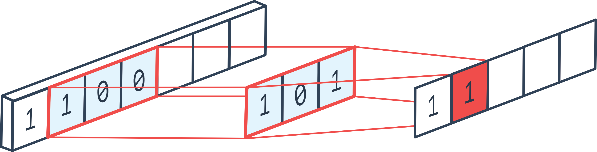
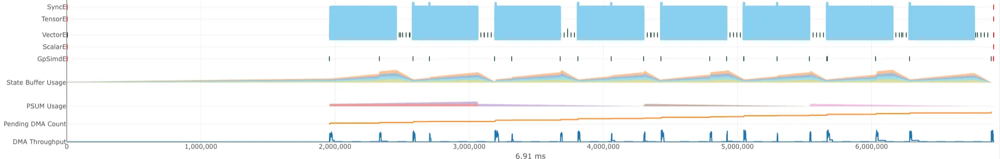
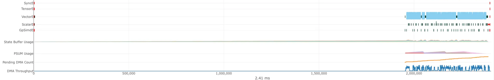

# How we made AWS Trainium 17x faster (for `conv1d`)

#### November 17, 2025

[Huijae An](https://www.linkedin.com/in/huijae-an/){:target="_blank" rel="noopener"} and [Charles Hong](https://charleshong3.github.io/)
 
UC Berkeley

### In this post, we take a deeper look at how Autocomp optimizes the [`conv1d_depthwise_default`](https://github.com/aws-neuron/nki-samples/blob/87846b2858735d99f53d79b9c836687cc05c2f81/contributed/neuron-team-kernels/conv.py#L925){:target="_blank" rel="noopener"} kernel provided by the [AWS Neuron Team](https://aws.amazon.com/ai/machine-learning/neuron/){:target="_blank" rel="noopener"}, achieving a 17.37x speedup in the final implementation.

<h3 style="margin-top: 0; margin-bottom: 15px; color: #333;">📋 Table of Contents</h3>

<ul style="margin: 0; padding-left: 20px; line-height: 1.4;">
<li><a href="#about-conv1d">About <code>conv1d</code></a></li>
<li><a href="#optimization-steps">Optimization Steps</a></li>
<li><a href="#conclusion">Conclusion</a></li>
</ul>

## About `conv1d`

1D convolution (`conv1d`) is a specialized case of a standard [2D convolution](https://github.com/ucb-152/lab6?tab=readme-ov-file#overview-of-2d-convolution){:target="_blank" rel="noopener"} where the filter height is fixed to 1. If you're familiar with `conv2d`, you can think of `conv1d` as sliding a narrow filter horizontally across a single spatial dimension.

<figure>
    
    <figcaption style="text-align:center">From <a href="https://ai.stackexchange.com/questions/28767/what-does-channel-mean-in-the-case-of-an-1d-convolution" target="_blank" rel="noopener">Stack Exchange</a>.</figcaption>
</figure>

In our case, the kernel performs a depthwise 1D convolution, meaning each input channel is convolved independently with its own filter (meaning `in_channel = out_channel`).

Here's the rough pseudocode of the original kernel:

  <figure class="code-container code-container-small" style="width: 100%;">
    

<pre><code class="language-python">def conv1d_depthwise_default(img, filters, output):
    """
    Input Shape: [N, C_in, 1, W]
    Filter Shape: [C_out, 1, 1, W_f]
    Output Shape: [N, C_out, 1, W]
    """

    # 1. Fetch the input into Trainium's Scratchpad (SBUF)
    img_local_prefetch_raw = nl.array(...)
    for n in range(N):
        for c_tiled in range(C_in // 128):
            img_local_prefetch_raw[n, [c_tiled+:128], :, :] = nl.load(...)
    
    # 2. Fetch the filters into Trainium's Scratchpad (SBUF)
    filter_local = nl.array(...)
    for c_tiled in range(C_out // 128):
        filter_local[[c_tiled+:128], :, :, :] = nl.load(...)

    # 3. Allocate the temporary output in Trainium's Scratchpad (SBUF)
    out_sb = nl.array(...)
    
    # 4. Perform depthwise convolution
    for n in range(N):
        for c_tiled in range(C_in // 128):
            for w in range(W):
                prod = nl.multiply(img[n, [c_tiled+:128], :, [w+:W_f]], filters[[c_tiled+:128], :, :, :])
                out_sb[n, [c_tiled+:128], :, w] = nl.sum(prod)
    
    # 5. Write the results back to the output in HBM
    for n in range(N):
        for c_tiled in range(C_out // 128):
            nl.store(output[...], out_sb[...])</code></pre>

  </figure>

Note that the output width matches the input width, rather than `input_width − filter_width + 1`. This is because we apply zero-padding on both sides of the input so that the output size stays consistent with the input.

In this case, we use `N = 8`, `in_channel = out_channel = 512`, `image_width = 2048`, and `filter_width = 3` . Part of Autocomp’s speedup comes from taking advantage of optimizations specific to this shape.

Lastly, to take advantage of [Trainium's optimized execution on 128-channel groups](https://awsdocs-neuron.readthedocs-hosted.com/en/latest/nki/arch/trainium_inferentia2_arch.html#trainium-inferentia2-architecture-guide-for-nki){:target="_blank" rel="noopener"}, we tile `in_channel` (and `out_channel`, since they’re the same) into groups of `128`. This layout is key to achieving high performance, and as we go through the optimization steps, we’ll see how Autocomp gradually leverages this structure to push the kernel closer to Trainium’s full potential.

## Optimization Steps

### Step 0

[Link to the code](https://github.com/ucb-bar/autocomp/blob/519c885b14911dba3ca44a49fdb04ff82612496d/examples/trn-advanced/4_conv1d_trace.py#L4){:target="_blank" rel="noopener"}

We first begin by pre-processing the kernel to make it easier to pass into Autocomp. Aside from stylistic changes and inlining helper functions that were previously declared outside the kernel, the only notable functional change is that we explicitly allocate and return the output tensor inside the kernel, instead of accepting a reference and modifying it in-place. This is necessary to comply with NKI compiler requirements and run the kernel standalone.

#### Pseudocode

  <figure class="code-container code-container-small" style="width: 100%;">
    

<pre><code class="language-python">def optimize_0(img, filters):
    # Inlined helper functions
    def div_ceil():
    def create_indices():
    
    # Explicitly allocate the output tensor in HBM instead of taking it as an argument
    out_hbm = nl.array(...)

    # ... (same as before)

    return out_hbm</code></pre>

  </figure>

Slowest `nc_latency` from 10 samples (with 2 warmup iters): **8.007 ms**

### Step 1

[Link to the code](https://github.com/ucb-bar/autocomp/blob/519c885b14911dba3ca44a49fdb04ff82612496d/examples/trn-advanced/4_conv1d_trace.py#L207){:target="_blank" rel="noopener"}

Autocomp attempts a hoisting optimization where it moves indexing of the loop-invariant `filter_local[c_tile, i_p_a, i_f_a]` tile outside of the innermost convolution loop, and assigns it to a new variable `filt_tile`. However, as we are indexing into SBUF, indexing is a logical operation that does not actually increase computation or data movement. As a result, latency remains the same.

#### Pseudocode

  <figure class="code-container code-container-small" style="width: 100%;">
    

<pre><code class="language-python">def optimize_1(img, filters):
    # ... (same as before)

    # 4. Perform depthwise convolution
    for n in range(N):
        for c_tiled in range(C_in // 128):
            # HOISTED: reuse the same filter sub-tile for all w
            filt_tile = filter_local[[c_tiled+:128], :, :, :]
            for w in range(W):
                prod = nl.multiply(img[n, [c_tiled+:128], :, [w+:W_f]], filt_tile)
                out_sb[n, [c_tiled+:128], :, w] = nl.sum(prod)
    
    # ... (same as before)</code></pre>

  </figure>

Latency: **8.007 ms (same as baseline)**

### Step 2

[Link to the code](https://github.com/ucb-bar/autocomp/blob/519c885b14911dba3ca44a49fdb04ff82612496d/examples/trn-advanced/4_conv1d_trace.py#L391){:target="_blank" rel="noopener"}

The kernel uses the helper function [`create_indices`](https://github.com/ucb-bar/autocomp/blob/519c885b14911dba3ca44a49fdb04ff82612496d/examples/trn-advanced/4_conv1d_trace.py#L213){:target="_blank" rel="noopener"} to generate broadcastable arrays for mapping indices (analogous to [NumPy's ogrid](https://numpy.org/doc/stable/reference/generated/numpy.ogrid.html#numpy-ogrid){:target="_blank" rel="noopener"}). One location where `create_indices` is used is at the end of the kernel, when writing results back to HBM. Autocomp removes `create_indices` in an attempt to “aggregate stores” and reduce the number of emitted store instructions, but the transformed code is semantically identical to the original. As a result, store behavior is unchanged and the latency remains essentially the same.

Note that in the first 2 optimization iterations, we allow slight increases in latency in order to encourage exploration in the initial stages of search.

[Pseudocode omitted]

Latency: **8.010 ms (0.99x speedup)**

### Step 3

[Link to the code](https://github.com/ucb-bar/autocomp/blob/519c885b14911dba3ca44a49fdb04ff82612496d/examples/trn-advanced/4_conv1d_trace.py#L652){:target="_blank" rel="noopener"}

Autocomp starts to make noticeable improvements to the kernel. It begins so by “optimiz[ing] memory buffer allocation” in the form of several optimizations:

1. Fetching only the required portions of the input and filter within each loop iteration, instead of prefetching the entire tensors into SBUF before entering the loop. This helps with reducing the SBUF pressure.
2. Replacing [`nl.load`](https://awsdocs-neuron.readthedocs-hosted.com/en/latest/nki/api/generated/nki.language.load.html){:target="_blank" rel="noopener"} with [`nisa.dma_copy`](https://awsdocs-neuron.readthedocs-hosted.com/en/latest/nki/api/generated/nki.isa.dma_copy.html){:target="_blank" rel="noopener"}, though they’re semantically the same.
3. Removing the use of `create_indices` entirely by generating a reusable tile, similar to step 2.
4. Fusing loops with identical boundaries, allowing for more aggressive compiler optimizations per iteration.
5. Allocating only the portion of the output currently being written in SBUF, then immediately writing it back to HBM, instead of storing the entire output in SBUF first and transferring it all at once.

#### Pseudocode

  <figure class="code-container code-container-small" style="width: 100%;">
    

<pre><code class="language-python">def optimize_3(img, filters):
    # Fuse everything into a single global loop
    out_hbm = nl.array(...)
    
    for n in range(N):
        for c_tiled in range(C_in // 128):
            # Allocate and fetch only the required portion per iteration to reduce SBUF pressure
            img_tile = nl.array(...)
            filt_tile = nl.array(...)
            out_tile = nl.array(...)

            # Replace nl.load with nisa.dma_copy (no effect)
            nisa.dma_copy(img_tile, img[n, [c_tiled+:128], :, :])
            nisa.dma_copy(filt_tile, filters[[c_tiled+:128], :, :, :])

            for w in range(W):
                # Omitted in pseudocode; no longer relies on create_indices
                prod = nl.multiply(img_tile[:, :, :, [w+:W_f]], filt_tile)
                out_tile[:, :, :, w] = nl.sum(prod)
            
            # Write to HBM immediately once results are ready
            nl.store(out_hbm[n, [c_tiled+:128], :, :], out_tile)
            
        return out_hbm</code></pre>

  </figure>

Latency: **7.934 ms (1.01x)**

### Step 4

[Link to the code](https://github.com/ucb-bar/autocomp/blob/519c885b14911dba3ca44a49fdb04ff82612496d/examples/trn-advanced/4_conv1d_trace.py#L800){:target="_blank" rel="noopener"}

Autocomp leverages [PSUM](https://awsdocs-neuron.readthedocs-hosted.com/en/latest/nki/programming_model.html#neuroncore-internal-memory){:target="_blank" rel="noopener"} to reduce memory traffic: for each convolution, instead of storing every output element directly to SBUF, it first stores them in PSUM, then performs a single PSUM → SBUF transfer using [`nisa.tensor_copy`](https://awsdocs-neuron.readthedocs-hosted.com/en/latest/nki/api/generated/nki.isa.tensor_copy.html){:target="_blank" rel="noopener"}. To ensure this PSUM buffer does not exceed its free-dimension limit, the kernel divides the convolution into blocks of size
`F_BLK = min(out_image_size, nl.tile_size.psum_fmax)`.

#### Pseudocode

  <figure class="code-container code-container-small" style="width: 100%;">
    

<pre><code class="language-python">def optimize_4(img, filters):
    # ... (same as before)
    
            # Group W into batches of 512
            F_BLK = min(W, nl.tile_size.psum_fmax) # nl.tile_size.psum_fmax = 512
            for w_tiled in range(W // F_BLK):
                out_psum = nl.array(...) # shape: [128, F_BLK]
                blk_base = F_BLK * w_tiled # starting index within W
                # Convolve, then write to the corresponding free dimension of PSUM
                for f in range(F_BLK):
                    prod = nl.multiply(img_tile[:, :, :, [blk_base+:W_f]], filt_tile)
                    out_psum += nl.sum(prod)
                # Copy PSUM data into SBUF
                out_sbuf_blk = nisa.tensor_copy(out_psum)
                # Write the copied portion to HBM
                nl.store(out_hbm[n, [c_tiled+:128], :, blk_base+:F_BLK], out_sbuf_blk)
    
    return out_hbm</code></pre>

  </figure>

#### Profiling Results

Now, let's use Trainium's [`neuron_profile`](https://awsdocs-neuron.readthedocs-hosted.com/en/latest/nki/neuron_profile_for_nki.html#neuron-profile-for-nki){:target="_blank" rel="noopener"} tool to take a deeper look at the differences before and after this optimization. Here is what the profile viewer shows us **before** the Step 4 optimization (i.e., `optimize_3`):

<figure>
    
</figure>

And **after** (`optimize_4`):

<figure>
    
</figure>

We see that once PSUM is utilized, the pressure on SBUF decreases and access to the filter weights becomes faster, leading to greater overall throughput and decreasing latency.

Latency: **5.602 ms (1.43x)**

### Step 5

[Link to the code](https://github.com/ucb-bar/autocomp/blob/519c885b14911dba3ca44a49fdb04ff82612496d/examples/trn-advanced/4_conv1d_trace.py#L1046){:target="_blank" rel="noopener"}

Autocomp reuses the loaded filter weights by swapping the loop order: it swaps the loop order from *“for each image → for each input channel”* to *“for each input channel → for each image”*, allowing the same filter weights to be reused across multiple images.

At the same time, Autocomp discards the Step 4 optimization that used PSUM to accelerate `nl.multiply` operations; it chooses to store the reusable filter weights in PSUM instead. Because PSUM has limited capacity and we want to avoid fill-and-reloads, Autocomp prioritizes placing the filters there. We see that this strategy results in a greater speedup than the previous optimization.

#### Pseudocode

  <figure class="code-container code-container-small" style="width: 100%;">
    

<pre><code class="language-python">def optimize_5(img, filters):
    out_hbm = nl.array(...)

    # Reorder the most & second most outer loops
    for c_tiled in range(C_in // 128):
        # Fetch the reusable filter and store in PSUM
        filt_sbuf = nl.load(filters[[c_tiled+:128], :, :, :])
        filt_psum = nisa.tensor_copy(filt_sbuf)
        for n in range(N):
            img_tile = nl.load(img[n, [c_tiled+:128], :, :])
            out_tile = nl.array(...)

            for w in range(W):
                prod = nl.multiply(img_tile[:, :, :, [w+:W_f]], filt_psum)
                out_tile[:, :, :, w] = nl.sum(prod)
            
            nl.store(out_hbm[n, [c_tiled+:128], :, :], out_tile)
    
    return out_hbm</code></pre>

  </figure>

Latency: **4.955 ms (1.62x)**

### Step 6

[Link to the code](https://github.com/ucb-bar/autocomp/blob/519c885b14911dba3ca44a49fdb04ff82612496d/examples/trn-advanced/4_conv1d_trace.py#L1296){:target="_blank" rel="noopener"}

Inside the convolution loop, Autocomp tiles the output width dimension into groups of 64.

  <figure class="code-container code-container-small" style="width: 100%;">
    

<pre><code class="language-python">for w in range(W):</code></pre>

  </figure>

  <figure class="code-container code-container-small" style="width: 100%;">
    

<pre><code class="language-python">for w_out_tile in range(W // 64):
	for w_in_tile in range(64):
		w = w_out_tile * 64 + w_in_tile</code></pre>

  </figure>

What’s interesting here is that the transformation is syntactic - the kernel does not actually process each 64 element group as a single combined operation; i.e., there is no manual coalescing of `nl.multiply` (actually implemented as [`tensor_tensor`](https://awsdocs-neuron.readthedocs-hosted.com/en/latest/nki/api/generated/nki.isa.tensor_tensor.html){:target="_blank" rel="noopener"}) or `nl.sum` (actually implemented as [`tensor_reduce`](https://awsdocs-neuron.readthedocs-hosted.com/en/latest/nki/api/generated/nki.isa.tensor_reduce.html){:target="_blank" rel="noopener"}) operations into a smaller number of larger operations in the code. However, this restructuring is enough to signal to the compiler that the work can be grouped, enabling it to aggressively schedule and optimize the convolution as if those 64 outputs were actually being processed together.

It isn’t entirely clear why Autocomp chooses a tile size of 64 instead of the more intuitive 128. However, we find that regardless of the value chosen, tiling by values near 128 (such as 32 or 64) appears enough for the compiler to perform its own grouping by a factor of 128, as we see from the operation counts we show below.

#### Pseudocode

  <figure class="code-container code-container-small" style="width: 100%;">
    

<pre><code class="language-python">def optimize_6(img, filters):
    # ... (same as before)
    
            NUM_FULL_BLOCKS = W // 64
            for w_out_tile in range(NUM_FULL_BLOCKS):
                base_out = w_out_tile * 64
                for w_in_tile in range(64):
                    prod = nl.multiply(img_tile[:, :, :, [(base_out + w_in_tile)+:W_f]], filt_psum)
                    out_tile[:, :, :, base_out + w_in_tile] = nl.sum(prod)
            nl.store(out_hbm[n, [c_tiled+:128], :, :], out_tile)
            
    return out_hbm</code></pre>

  </figure>

#### Profiling Results

For context, here is what the profile viewer shows us **before** the Step 6 optimization (`optimize_5`):

<figure>
    
</figure>

<figure style="display: flex; gap: 20px; justify-content: center; flex-wrap: wrap;">
    
    
</figure>

And **after** the optimization (`optimize_6`):

<figure>
    
</figure>

<figure style="display: flex; gap: 20px; justify-content: center; flex-wrap: wrap;">
    
    
</figure>

**Before:** In `optimize_5`, we had N * (C_in / 128) * W = 65536 individual `tensor_tensor` operations. We also had 65536 / 4 = 16384 individual `tensor_reduce` operations. This seems to imply that the NKI compiler is eagerly fusing `tensor_reduce` calls across four partition tiles at a time when the total number of `tensor_reduce` calls in a loop is unknown at compile time. If any Trainium experts can confirm this, please let us know!

These instructions combined were active for about 70% (55.56% + 14.85%) of the total profiled time, making them a prime target for optimization according to Amdahl’s law.

**After:** In `optimize_6`, we see that the number of `tensor_tensor` and `tensor_reduce` operations are now both just 512 (equal to 65536 / 128), meaning both operations are now likely being fused across 128 partition tiles. Their execution times decrease from 3.84 → 0.2ms and 1.03 → 0.2ms, now totaling only 17% (8.39% + 8.31%) of the profiled runtime. Since the kernel is primarily compute-bound on these two operations, this reduction leads to a substantial overall speedup.

Latency: **0.461 ms (17.37x)**

## Conclusion

Speedup Summary:

| **Optimization** | **Latency (ms)** | **Speedup** |
| --- | --- | --- |
| Baseline | 8.007 | 1.00x |
| Hoisted Filter Indexing | 8.007 | 1.00x |
| Removed `create_indices` | 8.010 | 0.99x |
| Loop Fusion + Optimized Memory Buffer Allocation | 7.934 | 1.01x |
| PSUM Buffer Allocation | 5.602 | 1.43x |
| Loop Order Interchange | 4.955 | 1.62x |
| Tile Hint | **0.461** | **17.37x** |

<figure>
    
    <figcaption style="text-align:center">Speedup summary chart.</figcaption>
</figure>

In this case study, we saw how Autocomp applies a range of kernel optimization techniques to improve the `conv1d` kernel provided by the AWS Neuron team. From conventional memory traffic optimizations to NKI-specific behaviors, Autocomp systematically transformed the code, exploring design spaces and edge cases that human kernel writers might not easily consider. We're excited to continue expanding our use of Autocomp and see what other applications it can optimize next.

Thanks to [Huijae An](https://www.linkedin.com/in/huijae-an/){:target="_blank" rel="noopener"}, an undergrad researcher working with us in the SLICE Lab, for leading the writeup of this blog post, and Haozheng Fan from the Neuron Science team for providing feedback and insights.