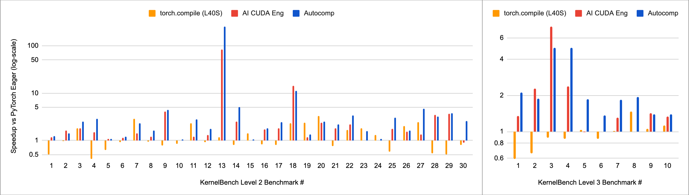
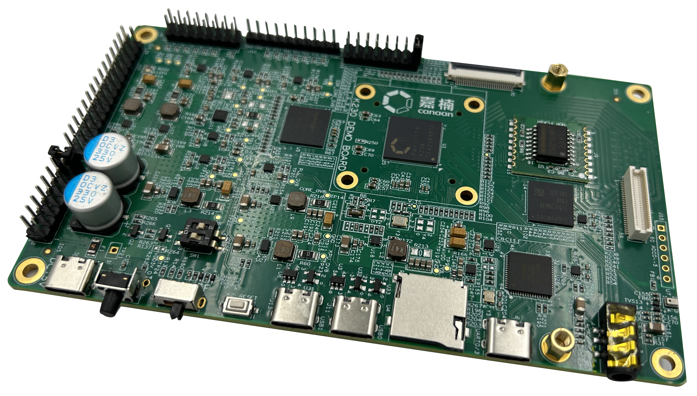
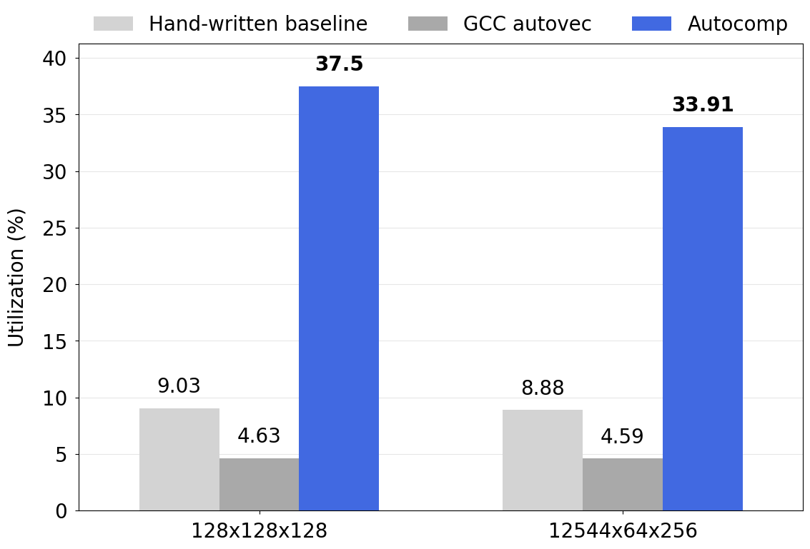

<figure>
    
    <!-- <figcaption style="text-align:center">The growing landscape of tensor accelerators.</figcaption> -->
</figure>

# Autocomp for All: Update on CUDA and RVV Optimization with Autocomp

#### September 19, 2025

[Charles Hong](https://charleshong3.github.io/){:target="_blank" rel="noopener"}, [Sahil Bhatia](https://x.com/sahilb17){:target="_blank" rel="noopener"}, [Alvin Cheung](https://people.eecs.berkeley.edu/~akcheung/){:target="_blank" rel="noopener"}, and [Yakun Sophia Shao](https://people.eecs.berkeley.edu/~ysshao/){:target="_blank" rel="noopener"}
<br/>
UC Berkeley

### An update on our last [blog post](https://charleshong3.github.io/blog/autocomp.html): we have successfully applied Autocomp to two new hardware platforms—a GPU and a vector processor—achieving state-of-the-art performance! All code available now on our [GitHub repo](https://github.com/ucb-bar/autocomp){:target="_blank" rel="noopener"}.

---

This past June we introduced Autocomp, a method for using LLMs to help hardware designers extract the full performance of AI accelerators. Autocomp was super effective on two different tensor accelerator configurations generated by [Gemmini](https://github.com/ucb-bar/gemmini).

However, nothing in Autocomp's approach inherently limits it to Gemmini, or to systolic array accelerators. In the paper, we include Gemmini's ISA in context due to its super low-resource nature, but with more common languages like CUDA, we can omit this component. Furthermore, Autocomp's optimization menu consists of simple, high-level optimizations. Some of these menu options are applicable across hardware platforms, and new ones can easily be added at the user's discretion.

Incidentally, GPU kernel optimization is all the rage these days.[^1] [^2] [^3] [^4] [^5] And a little more quietly, RISCV-V vector (RVV) processors have also been gaining traction since version 1.0 of the RVV extension was ratified in 2021.[^6] [^7] [^8] [^9]

---

## CUDA Optimization

While Autocomp is designed with tensor accelerators in mind, we were also curious how it might perform on GPU software, particularly tensor-based computations on GPUs. We were able to easily adapt Autocomp to NVIDIA GPUs. We benchmark with [KernelBench](https://github.com/ScalingIntelligence/KernelBench) v0, a set of 250 PyTorch benchmarks mainly consisting of tensor computations from deep learning. KernelBench has 4 levels:

- Level 1: 100 Single-kernel operators
- Level 2: 100 Sequences of operators (e.g., Conv + Bias + ReLU, Matmul + Scale + Sigmoid)
- Level 3: 50 Full model architectures
- Level 4: 20 Whole model architectures from HuggingFace

In a cursory investigation, we optimized the first 30 level 2 problems and the first 10 level 3 problems. We did not tackle level 4 as this is an aspirational benchmark (as stated by KernelBench’s authors) with a lack of prior results.

Autocomp’s results are extremely positive. We achieved the following state-of-the-art speedups: 2.61x on the first 30 problems of level 2, and 2.11x on the first 10 problems of level 3.

### Changes to Autocomp

We made the following changes to Autocomp. Please reference the [original paper](https://arxiv.org/abs/2505.18574){:target="_blank" rel="noopener"} for the original implementation.

- **Beam search parameters**: beam size 6, 6 plans per element in beam, 2 implementations per plan, 10 iterations

- **Increased menu option dropout** to **80%** due to large menu (see below).

- **Removed Accelerator ISA** component of prompt, as Python/PyTorch/CUDA are relatively high-resource languages in comparison to Gemmini and other tensor accelerators (note that the Accelerator ISA is still important an important component for tensor accelerator code optimization, as shown in Appendix A of the original paper).

- **Hardware Performance Feedback** includes the latency of Current Code in milliseconds.
    - As this was a quick experiment, we opted not to set up any additional tracing or performance analysis tools, and only used the latency (in ms) of the current code candidate as feedback. We achieve strong results nonetheless, meaning we could potentially do even better with more sophisticated feedback that can point search in the right direction.

- In the **first two iterations** of search, as KernelBench provides only a Python baseline, we focus on generating an initial inline CUDA implementation using the following reduced menu:

          "Convert PyTorch code to functional PyTorch code",
          "Convert a PyTorch operation to inline CUDA C++ code",

- A new **Optimization Menu**, designed by combining a subset of optimizations from Autocomp and human-written optimizations sourced from a variety of CUDA and GPU code optimization guides. For example,"Use shared memory to reduce global memory bandwidth usage", or "Minimize divergent branches within warps" (the full menu is available in [`llm_agent.py`](https://github.com/ucb-bar/autocomp/blob/aa3c1ff39ad22c31abc3aa4008baaa071136960b/autocomp/search/llm_agent.py#L836){:target="_blank" rel="noopener"}).

We compare to the following baselines:

- PyTorch’s default eager execution mode.
- torch.compile: a JIT compilation mode integrated into PyTorch.
- [Kernelsseum](https://scalingintelligence.stanford.edu/KernelBenchLeaderboard/){:target="_blank" rel="noopener"}: The KernelBench authors collected the best zero-shot generation results across 5 models via a simple prompting-based approach.
- [The AI CUDA Engineer](https://sakana.ai/ai-cuda-engineer/){:target="_blank" rel="noopener"} leverages an agentic flow including separate stages for code translation and evolutionary optimization, GPU profiling feedback, and RAG for retrieving related high-performance kernels. They report speedups from an NVIDIA H100, whereas baselines and our results use NVIDIA L40S GPUs. However, KernelBench reports comparable results on the H100 and the L40S (for example, they found that DeepSeek-R1 was able to speed up 42% of level 2 kernels on the H100, compared to 36% on the L40S), so we do not expect speedups to change drastically across these GPU models.

### Results

Geomean speedups over PyTorch’s default eager execution mode are as follows:

| Baseline | Speedup (Level 2 first 30, geomean) | Speedup (Level 3 first 10, geomean) |
|----------|-------------------------------------|-------------------------------------|
| torch.compile (L40S) | 1.11x | 0.93x |
| Kernelsseum (L40S) | 1.14x | 0.89x |
| AI CUDA Engineer (H100) | 1.91x | 1.63x |
| **Autocomp (L40S)** | **2.61x** | **2.11x** |

And here are the results, by benchmark:

<figure>
    
    <figcaption style="text-align:center">Performance of Autocomp-generated code on individual KernelBench benchmarks.</figcaption>
</figure>

Looking through the generated code, I was able to confirm that Autocomp successfully generated CUDA, rather than simply optimizing PyTorch (except for a few special cases).

The key differences between Autocomp and AI CUDA Engineer, another search-based approach to code optimization, include several of our contributions: Autocomp’s two-phase prompting (Plan-then-Implement), Optimization Menu, and Optimization Menu dropout.

This experiment illustrates Autocomp’s effectiveness on real world hardware against production baselines from PyTorch, in both its default and JIT compiled execution modes, as well concurrent work in LLM-based CUDA code optimization.

## RVV Optimization

<figure>
    
    <figcaption style="text-align:center">The Canaan Kendryte K230 dev board.</figcaption>
</figure>

The Canaan Kendryte K230 dev board contains an RVV 1.0-compliant XuanTie C908 core, used to accelerate tensor computation. We chose this board because it was available to us. Thanks to Autocomp’s portability, we were able to start optimizing code for it in just a couple days and can share preliminary results.

Specifically, we optimize two GEMM kernels starting from a simple hand-written RVV-based implementation.

We made the following changes to Autocomp:

- **Beam search parameters**: same as GEMM in paper

- **Menu option dropout: 80%**

- Shorten Accelerator ISA to the following: **“This code is running on a Kendryte K230 with a XuanTie C908 RVV 1.0 compliant processor with 128-bit VLEN and 32KB L1 cache.”**

- **Hardware Performance Feedback** includes only latency in cycles

- Add new options to the **Optimization Menu** used for GEMM/conv on Gemmini:

              "prefetching",  
              "register blocking",  
              "maximize LMUL",  
              "use fused operations or instructions",

- Use the following **Rules**:

    1. The rewritten program should be semantically equivalent to the original program.
    2. Limit the scope of the plan to the selected optimization.
    3. Only function gemm_f32 will be imported during evaluation. Feel free to define new variables, functions, etc., but make sure they are used by gemm_f32.
    4. The code will be compiled with the following command:
    ```
    riscv64-unknown-linux-gnu-gcc -S -O1 -march=rv64gcv -mabi=lp64d -mcmodel=medany code.c -o code.s
    ```

### Results

We compared Autocomp-generated code to two baselines:

1. A simple hand-written 3-loop GEMM implementation written using RVV intrinsics (also used as the starting code for Autocomp).
2. GCC auto-vectorization of a simple 3-loop scalar implementation, compiled using gcc 15.1.0 with flags `-O3`, `-ftree-vectorize`, and `-fopt-info-vec-optimized`.

As this was a quick experiment to see if Autocomp works for RVV, our benchmark suite consists simply of two GEMM kernels.

<figure>
    
    <figcaption style="text-align:center">Performance of the Autocomp-generated code on the Canaan Kendryte K230 dev board.</figcaption>
</figure>

<!-- | Baseline | Latency (cycles) | Utilization |
|----------|------------------|-------------|
| Simple hand-written 3-loop GEMM implementation written using RVV intrinsics (starting code for Autocomp) | 5,808,621 | 9.03% |
| GCC auto-vectorization: simple 3-loop scalar implementation, compiled using gcc 15.1.0 w/ flags -O3 -ftree-vectorize -fopt-info-vec-optimized | 11,324,414 | 4.63% |
| **Autocomp** | **1,398,023** | **37.5%** | -->

**Autocomp beats GCC auto-vectorization by 8.10x and 7.39x respectively!** It also improves upon the hand-written baseline by 4.15x and 3.82x respectively.
The generated code includes optimizations such as register blocking, loop reordering and tiling, hoisting, and prefetching. 

## Conclusion

I am not an expert CUDA or RVV programmer. But with Autocomp, I was able to achieve state-of-the-art performance numbers with just a little bit of effort!

The version of Autocomp used for CUDA optimization is available at the main branch of our [GitHub repo](https://github.com/ucb-bar/autocomp){:target="_blank" rel="noopener"}, while the RVV version currently lives on the `k230` branch. Documentation coming soon.

In future work (and future blog posts), we hope to further explore how Autocomp can be used to optimize code across a variety of hardware platforms, as well as make Autocomp more efficient and even more effective at optimizing code.

Email me at [charleshong@berkeley.edu](mailto:charleshong@berkeley.edu) if you have any questions.

## References

[^1]: [Ouyang et al. 2025, "KernelBench: Can LLMs Write Efficient GPU Kernels?"](https://github.com/ScalingIntelligence/KernelBench){:target="_blank" rel="noopener"}
[^2]: [Chen et al. 2025, "Automating GPU Kernel Generation with DeepSeek-R1 and Inference Time Scaling"](https://developer.nvidia.com/blog/automating-gpu-kernel-generation-with-deepseek-r1-and-inference-time-scaling/){:target="_blank" rel="noopener"}
[^3]: [Lange et al. 2025, "The AI CUDA Engineer"](https://sakana.ai/ai-cuda-engineer/){:target="_blank" rel="noopener"}
[^4]: [Baronia et al. 2025, "Kevin-32B: Multi-Turn RL for Writing CUDA Kernels"](https://cognition.ai/blog/kevin-32b){:target="_blank" rel="noopener"}
[^5]: [METR 2025, "Measuring Automated Kernel Engineering"](https://metr.org/blog/2025-02-14-measuring-automated-kernel-engineering/){:target="_blank" rel="noopener"}
[^6]: [SiFive Intelligence X300 Series](https://www.sifive.com/cores/intelligence-x300-series){:target="_blank" rel="noopener"}
[^7]: [AndesCore™ AX45MPV](https://www.andestech.com/en/products-solutions/andescore-processors/riscv-ax45mpv/){:target="_blank" rel="noopener"}
[^8]: [XuanTie C930](https://www.xrvm.com/product/xuantie/C930){:target="_blank" rel="noopener"}
[^9]: [Zhao et al. 2025, "The Saturn Microarchitecture Manual"](https://saturn-vectors.org/){:target="_blank" rel="noopener"}
